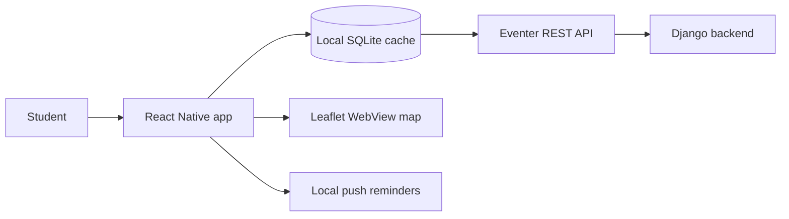

# Eventer — Campus Events Discovery App (Mobile)

**React Native client with interactive campus map, offline SQLite sync, and event reminders**

**React Native · Expo · TypeScript · TanStack Query · SQLite (Drizzle) · Leaflet · expo-notifications**

**Backend API:** [Eventer](../Eventer/) (Django + Celery)

---

## What It Is

Students need one place to discover what's happening on campus today — on a map, with filters, and without creating an account. **Eventer** is that app for **Dartmouth College**: a React Native mobile client that consumes the Eventer backend API, caches data locally for offline use, and surfaces events on an interactive Leaflet campus map.

This repository is the mobile app: UI, navigation, map rendering, local SQLite storage, and push-notification reminders. Events, buildings, and the scraper pipeline live in the backend repo.

---

## Highlights

This maps directly to the mobile portion of the project:

- **Developed a read-optimized Django REST Framework API and React Native application** with an interactive Leaflet map, local SQLite delta synchronization, and push-notification reminders.

| Capability | Implementation |
| ---------- | -------------- |
| Read-optimized client | Typed REST client in [`src/api/client.ts`](src/api/client.ts); TanStack Query with 30-min polling and pull-to-refresh |
| Interactive Leaflet map | Leaflet 1.9.4 in WebView ([`src/components/map/leafletHtml.ts`](src/components/map/leafletHtml.ts), [`CampusWebMap.tsx`](src/components/map/CampusWebMap.tsx)); GeoJSON building footprints; category-colored markers |
| SQLite delta synchronization | Local Drizzle schema and cache in [`src/db/`](src/db/); sync metadata (`last_synced_at`); incremental updates via API `?since=` parameter; offline fallback with "Last updated" banner |
| Push-notification reminders | Per-event reminders via `expo-notifications` ([`src/utils/notifications.ts`](src/utils/notifications.ts)); reconcile on sync; user-configurable offsets in Settings |

**Also includes:** onboarding flow, day/category/search filters, event detail sheet, hide/dismiss events, directions to building, light/dark theme, and the Lumina glass UI design system ([`eventer_designs/lumina_campus/DESIGN.md`](eventer_designs/lumina_campus/DESIGN.md)).

---

## Architecture



---

## Quick Run

```bash
npm install
cp .env.example .env
npx expo start
```

Set `EXPO_PUBLIC_API_URL` in `.env` to your backend URL. Use your LAN IP (not `localhost`) when testing on a physical device; use `http://10.0.2.2:8000` for the Android emulator.

The backend must be running for API sync (`python manage.py runserver` in the [Eventer](../Eventer/) repo).

---

## Developer Reference

Detailed integration guide for frontend developers and contributors.

### Mobile App Quick Start

```bash
npm install
cp .env.example .env
npx expo start
```

Set `EXPO_PUBLIC_API_URL` in `.env` to your backend URL. Use your LAN IP (not `localhost`) when testing on a physical device; use `http://10.0.2.2:8000` for the Android emulator.

**UI designs:** Screen mockups and the Lumina design system live in [`eventer_designs/`](eventer_designs/) — see [`eventer_designs/lumina_campus/DESIGN.md`](eventer_designs/lumina_campus/DESIGN.md) for tokens and category colors.

#### Four-stage testing summary

| Stage | Focus | How to verify |
| ----- | ----- | ------------- |
| **1 — Onboarding** | Lumina glass UI, fonts, 3-slide welcome flow | Swipe through slides; **Skip** and **Let's Go** reach the main app; relaunch skips onboarding |
| **2 — API & sync** | Typed client, TanStack Query, SQLite cache, 30-min polling | Events load from backend; times show in Eastern; pull-to-refresh works; airplane mode shows cached data + "Last updated" banner |
| **3 — Campus map** | GeoJSON polygons, category markers, search & filters | Map centers on Dartmouth; markers at building coords; search/filter narrows results; tap marker opens preview sheet |
| **4 — Settings & reminders** | Preferences, dismissals, local notifications | Theme and category toggles persist; **Set Reminder** schedules notification; **Hide Event** removes marker; **Directions** opens maps |

Backend must be running for Stages 2–4 (`python manage.py runserver` in the backend repo). See Section 3 below for setup.

---

### Frontend Integration Guide

This section describes everything a frontend developer (or agent) needs to build the **Eventer mobile app** against the Eventer backend. The backend lives in a separate repository; this file is the contract between the two.

---

### 1. Product Overview

**Eventer** is a campus event discovery app for **Dartmouth College**. Students browse upcoming events, filter by category, view events on a campus map, and manage personal preferences locally on their device.

#### Repository boundary

| Owned by backend repo | Owned by frontend repo |
| ----------------------- | ---------------------- |
| Events, buildings, scrape sources (source of truth) | UI, navigation, map rendering |
| Public read-only REST API | Local SQLite (preferences, reminders, dismissals, onboarding) |
| Scraper pipeline + admin portal | Campus GeoJSON asset (building footprints for Leaflet map) |
| Category metadata (slug, label, accent color) | Category icon assets |
| Building coordinates + `geojson_id` linkage | Push/local notification scheduling |

There are **no user accounts** on the public API. All personalization is client-side only.

---

### 2. Backend Tech Stack (context only)

- **Framework:** Django + Django REST Framework
- **Database:** SQLite (dev) → PostgreSQL (planned for production)
- **Scheduled tasks:** Celery + Redis (scraper runs ~every 3 hours per source)
- **Timezone:** All datetimes stored and returned in **UTC** (`USE_TZ = True`, `TIME_ZONE = "UTC"`)

You do not need to run the scraper or admin portal to build the mobile app — only the public API.

---

### 3. Connecting to the Backend

#### Base URL

Configure a single base URL for all requests:

| Environment | Example base URL |
| ----------- | ---------------- |
| Local dev   | `http://127.0.0.1:8000` or `http://localhost:8000` |
| Production  | TBD (e.g. `https://api.eventer.app`) — set via env/config |

All public endpoints are prefixed with `/api/`.

#### Running the backend locally

```bash
# In the backend repo
pip install -r requirements.txt
python manage.py migrate
python manage.py loaddata core/fixtures/buildings.json core/fixtures/sample_events.json  # optional sample data
python manage.py runserver
```

Verify: `GET http://localhost:8000/api/events/` should return JSON.

#### Authentication

**None required.** The public API is fully open and read-only. Do not send auth headers.

#### CORS / network

- **React Native (iOS/Android):** No CORS restrictions — call the API directly with `fetch` or your HTTP client of choice.
- **Expo web / browser dev:** CORS is **not currently configured** on the backend. If you need browser-based dev, ask the backend team to add `django-cors-headers`, or use a dev proxy.

#### Response format

- Content-Type: `application/json`
- List endpoints return a **JSON array** directly (no pagination wrapper, no `{ count, results }` envelope).
- Detail endpoints return a single JSON object.
- Errors follow DRF conventions, e.g. `{ "detail": "No Event matches the given query." }` with HTTP 404.

---

### 4. Public API Reference

#### 4.1 List events

```
GET /api/events/
```

Returns all **active** events (`is_active = true`). Inactive/soft-deleted events are never included.

##### Query parameters

| Param      | Type   | Example              | Description |
| ---------- | ------ | -------------------- | ----------- |
| `days`     | int    | `?days=7`            | Events whose `start_time` falls between **now** and now + N days (inclusive). **Recommended default for app launch sync.** |
| `date`     | date   | `?date=2026-07-01`   | Events whose `start_time` falls on this calendar date (UTC date component). |
| `category` | string | `?category=food`     | Filter by category. Accepts full slug (`free_food`) or short alias (`food`). See Section 6. |
| `since`    | ISO datetime | `?since=2026-06-28T12:00:00Z` | Events with `updated_at >= since`. Use for **delta sync** after initial load. |

Parameters can be combined, e.g. `?days=7&category=food`.

##### Example request

```
GET /api/events/?days=7
```

##### Example response

```json
[
  {
    "id": "a1000000-0000-4000-8000-000000000001",
    "event_name": "Free Pizza Study Break",
    "building": {
      "id": 3,
      "official_name": "Collis Center",
      "lat": 43.7048,
      "lng": -72.2865,
      "geojson_id": "collis-center",
      "aliases": [
        { "id": 4, "alias": "Collis", "source": "admin" }
      ]
    },
    "unresolved_location": null,
    "start_time": "2026-07-01T18:00:00Z",
    "end_time": "2026-07-01T20:00:00Z",
    "description": "Free pizza for all students in Collis Common Ground.",
    "category": "free_food",
    "other_info": {
      "has_food": true,
      "needs_registration": false,
      "needs_invite": false,
      "guests_allowed": true,
      "contact_email": "collis@dartmouth.edu"
    },
    "source_url": "https://dartmouth.edu/events/pizza-study-break",
    "created_at": "2026-06-28T12:00:00Z",
    "updated_at": "2026-06-28T12:00:00Z",
    "is_active": true,
    "is_verified": true
  }
]
```

---

#### 4.2 Single event detail

```
GET /api/events/<uuid>/
```

Returns one event by UUID. Same shape as a list item. Returns **404** if the event does not exist or is inactive.

##### Example

```
GET /api/events/a1000000-0000-4000-8000-000000000001/
```

---

#### 4.3 List buildings

```
GET /api/buildings/
```

Returns all campus buildings with coordinates and aliases. Use this to populate the map, building picker, or a local building cache.

##### Example response

```json
[
  {
    "id": 1,
    "official_name": "Baker-Berry Library",
    "lat": 43.7054,
    "lng": -72.2887,
    "geojson_id": "baker-berry-library",
    "aliases": [
      { "id": 1, "alias": "Baker", "source": "admin" },
      { "id": 2, "alias": "Berry", "source": "admin" }
    ]
  }
]
```

**Important:** `geojson_id` must match the `name` (or feature id) of the corresponding polygon in your bundled campus GeoJSON file. The backend does **not** serve GeoJSON — you ship it as a static asset in the frontend repo.

---

#### 4.4 List categories

```
GET /api/categories/
```

Returns all event categories with display metadata. Icon image files are **frontend-owned**; the backend only provides slug, human label, and accent color name.

##### Example response

```json
[
  {
    "slug": "free_food",
    "label": "Free Food",
    "accent_color": "Orange"
  },
  {
    "slug": "academic_lecture",
    "label": "Academic / Lecture",
    "accent_color": "Dartmouth Green"
  }
]
```

Fetch once on startup (or cache aggressively) — this list changes rarely.

---

### 5. Data Models (TypeScript)

Use these types in the frontend. Field names match the API exactly.

```typescript
type CategorySlug =
  | "academic_lecture"
  | "social_party"
  | "free_food"
  | "sports_athletics"
  | "arts_performance"
  | "career_professional"
  | "club_org_meeting"
  | "religious_spiritual"
  | "volunteer_community"
  | "health_wellness";

type BuildingAliasSource = "scraper" | "admin" | "student_report";

interface BuildingAlias {
  id: number;
  alias: string;
  source: BuildingAliasSource;
}

interface Building {
  id: number;
  official_name: string;
  lat: number;
  lng: number;
  geojson_id: string;
  aliases: BuildingAlias[];
}

interface EventOtherInfo {
  has_food?: boolean;
  needs_registration?: boolean;
  needs_invite?: boolean;
  guests_allowed?: boolean;
  contact_email?: string;
  // Backend may add keys over time — treat as open object
  [key: string]: unknown;
}

interface Event {
  id: string; // UUID
  event_name: string;
  building: Building | null;
  unresolved_location: string | null;
  start_time: string; // ISO 8601 UTC, e.g. "2026-07-01T18:00:00Z"
  end_time: string;
  description: string;
  category: CategorySlug;
  other_info: EventOtherInfo;
  source_url: string;
  created_at: string;
  updated_at: string;
  is_active: boolean;
  is_verified: boolean;
}

interface Category {
  slug: CategorySlug;
  label: string;
  accent_color: string;
}
```

---

### 6. Event Categories

Full slug → label → accent color mapping:

| Slug (`category` field) | Label | Accent Color | Short alias (for `?category=` filter) |
| ----------------------- | ----- | ------------ | --------------------------------------- |
| `academic_lecture`      | Academic / Lecture | Dartmouth Green | `academic` |
| `social_party`          | Social / Party | Purple | `social` |
| `free_food`             | Free Food | Orange | `food` |
| `sports_athletics`      | Sports / Athletics | Red | `sports` |
| `arts_performance`      | Arts / Performance | Pink | `arts` |
| `career_professional`   | Career / Professional | Blue | `career` |
| `club_org_meeting`      | Club / Org Meeting | Teal | `club` |
| `religious_spiritual`   | Religious / Spiritual | Gold | `religious` |
| `volunteer_community`   | Volunteer / Community | Lime | `volunteer` |
| `health_wellness`       | Health / Wellness | Mint | `health` |

In API responses, `category` is always the full slug (e.g. `free_food`). In filter queries, short aliases work (`?category=food` → `free_food`).

---

### 7. Field Semantics

#### Datetimes

- All timestamps are **UTC** ISO 8601 strings ending in `Z`.
- Convert to **America/New_York** (Dartmouth local time) for display.
- Example: `"2026-07-01T18:00:00Z"` → 2:00 PM EDT on July 1.

#### `building` vs `unresolved_location`

| Scenario | `building` | `unresolved_location` | UI guidance |
| -------- | ---------- | ----------------------- | ----------- |
| Location resolved | Full nested `Building` object | `null` | Show `building.official_name`; highlight on map via `geojson_id` |
| Scraper couldn't match location | `null` | Raw string, e.g. `"Mysterious Hall"` | Show `unresolved_location` as location text; **no map pin** |
| No location at all | `null` | `null` | Show "Location TBD" or hide location row |

Events with unresolved locations may still appear in the API until an admin maps them. They are active events — don't filter them out unless you choose to hide unmapped ones in the map view.

#### `other_info`

JSON object with optional flags scraped or entered by admins:

| Key | Type | Meaning |
| --- | ---- | ------- |
| `has_food` | boolean | Event offers food |
| `needs_registration` | boolean | Registration required |
| `needs_invite` | boolean | Invite-only |
| `guests_allowed` | boolean | Non-students welcome |
| `contact_email` | string | Contact for questions |

Keys may be missing or `{}` entirely — always default safely.

#### `is_verified`

- `true`: Admin has reviewed/confirmed the event.
- `false`: Raw scrape, not yet verified.
- Optional UI badge; both verified and unverified events are returned.

#### `is_active`

Always `true` in the public API (inactive events are filtered out server-side). Present for forward compatibility if delta sync ever needs to detect removals client-side.

#### `source_url`

Link to the original event page. Open in an in-app browser or external browser when the user taps "More info".

---

### 8. Recommended Sync Strategy

The backend expects the mobile app to follow this pattern:

#### Initial load (app launch)

```
GET /api/events/?days=7
GET /api/buildings/
GET /api/categories/
```

Store events and buildings in local state/cache (and optionally SQLite for offline). Categories can be cached long-term.

#### Background refresh (while app is open)

Poll every **30 minutes**:

```
GET /api/events/?days=7
```

Or, for a lighter delta sync once you have a last-sync timestamp:

```
GET /api/events/?since=<last_synced_at>
```

`since` filters on `updated_at >= value`. Merge results into local cache by event `id`:
- **New id** → insert
- **Existing id** → update fields
- **Missing from response but was in cache** → if using full `?days=7` refresh, remove events no longer returned; if using `?since` only, rely on periodic full refresh to catch deactivations

#### Handling server-side removals

When the scraper misses an event twice, the backend sets `is_active = false` and it disappears from the public API. A full `?days=7` refresh is the simplest way to reconcile deletions. Events are hard-deleted 7 days after `end_time`.

#### Offline

The backend does not support offline-first sync protocols (no ETags, no sync tokens). Cache the last successful response locally and show stale data with a "last updated" indicator when offline.

---

### 9. Campus Map Integration

#### GeoJSON (frontend-owned)

- Bundle a static Dartmouth campus GeoJSON file in the frontend repo.
- Each polygon feature's `name` (or id) must match a building's `geojson_id` from `GET /api/buildings/`.
- Example mapping: GeoJSON feature `"collis-center"` ↔ building `{ "geojson_id": "collis-center", "official_name": "Collis Center" }`.

#### Linking events to map polygons

1. Fetch events (each has nested `building.geojson_id` when resolved).
2. Fetch buildings once for coordinates fallback / labels.
3. On the Leaflet (or similar) map, highlight the polygon whose id matches `event.building.geojson_id`.
4. For events with `building: null`, show in list view but skip map marker/polygon highlight.

#### Building aliases

Aliases (e.g. "Hop" → Hopkins Center) are for the **scraper's** location matching, not typically shown in the UI. Display `building.official_name`.

---

### 10. Client-Local Data (NOT from backend)

These features are **entirely frontend-owned** in local SQLite (or equivalent). Do not call the backend for them:

- User preferences (theme, default filters)
- Onboarding completion state
- Dismissed/hidden events
- Event reminders / local push notifications
- Favorite buildings or categories

If the user dismisses an event, store `{ event_id, dismissed_at }` locally and filter it out of the UI — the backend will still return the event.

---

### 11. Example API Client

```typescript
const API_BASE = process.env.EXPO_PUBLIC_API_URL ?? "http://localhost:8000";

async function apiGet<T>(path: string): Promise<T> {
  const res = await fetch(`${API_BASE}${path}`);
  if (!res.ok) {
    const body = await res.json().catch(() => ({}));
    throw new Error(body.detail ?? `HTTP ${res.status}`);
  }
  return res.json();
}

export const eventerApi = {
  getEvents: (params?: {
    days?: number;
    date?: string;       // YYYY-MM-DD
    category?: string;
    since?: string;      // ISO datetime
  }) => {
    const qs = new URLSearchParams();
    if (params?.days != null) qs.set("days", String(params.days));
    if (params?.date) qs.set("date", params.date);
    if (params?.category) qs.set("category", params.category);
    if (params?.since) qs.set("since", params.since);
    const query = qs.toString();
    return apiGet<Event[]>(`/api/events/${query ? `?${query}` : ""}`);
  },

  getEvent: (id: string) =>
    apiGet<Event>(`/api/events/${id}/`),

  getBuildings: () =>
    apiGet<Building[]>("/api/buildings/"),

  getCategories: () =>
    apiGet<Category[]>("/api/categories/"),
};
```

---

### 12. Error Handling

| HTTP status | Meaning | Suggested UX |
| ----------- | ------- | ------------ |
| 200 | Success | Render data |
| 404 | Event not found (detail endpoint) | "Event no longer available" |
| 500 | Server error | Retry with backoff; show cached data if available |
| Network failure | Backend unreachable | Offline mode with cached data |

DRF error body shape: `{ "detail": "..." }` (string) or field-level validation errors (not expected on GET endpoints).

---

### 13. What the Backend Does NOT Provide

Do **not** expect these from the public API:

- User login, registration, or profiles
- POST/PUT/PATCH/DELETE on events or buildings
- GeoJSON map tiles or building footprints
- Category icon files (only slug + label + accent color name)
- Push notification delivery
- Search/full-text query (filter client-side or add a future backend endpoint)
- Pagination (all matching events returned in one array — fine for ~hundreds of campus events)

The **admin API** at `/api/admin/*` exists for staff only (session/token auth). The mobile app should never call it.

---

### 14. Backend Data Lifecycle (helps explain UI behavior)

Understanding how events change on the server:

1. **Scraper** runs every ~3 hours per active source, inserts/updates events.
2. **Deduplication** by `event_name + building + start_time` — updates in place, bumps `updated_at`.
3. **Missing from scrape** → after 2 consecutive misses, `is_active = false` (disappears from public API).
4. **Hard delete** → 7 days after `end_time`.
5. **Admin edits** also bump `updated_at` — delta sync catches these.

Events can change time, location, or description after the user has already seen them. Reminder logic should re-read `start_time`/`end_time` on each sync.

---

### 15. Suggested Frontend Architecture

```
┌─────────────────────────────────────────────────────┐
│                   Mobile App                        │
├─────────────────────────────────────────────────────┤
│  UI (React Native)                                  │
│    ├── Event list / detail                          │
│    ├── Category filters                             │
│    ├── Campus map (Leaflet + bundled GeoJSON)       │
│    └── Settings / reminders / dismissals          │
├─────────────────────────────────────────────────────┤
│  Local SQLite                                       │
│    ├── Cached events & buildings (optional)         │
│    ├── last_synced_at                               │
│    ├── dismissed_event_ids                          │
│    └── reminder schedules                           │
├─────────────────────────────────────────────────────┤
│  API layer → GET /api/events|buildings|categories   │
└─────────────────────────────────────────────────────┘
                          │
                          ▼
              Eventer Django Backend (separate repo)
```

---

### 16. Quick Reference

| Action | Request |
| ------ | ------- |
| Events for next 7 days | `GET /api/events/?days=7` |
| Events on a specific day | `GET /api/events/?date=2026-07-01` |
| Food events only | `GET /api/events/?category=food` |
| Delta sync | `GET /api/events/?since=2026-06-28T12:00:00Z` |
| Single event | `GET /api/events/<uuid>/` |
| All buildings | `GET /api/buildings/` |
| Category metadata | `GET /api/categories/` |

**Auth:** none  
**Pagination:** none  
**Timestamps:** UTC ISO 8601  
**Primary sync interval:** 30 minutes while app is open  
**Default fetch window:** 7 days
